# Seshat

This repository provides a collection of Bash scripts to automate the setup of an Azure Kubernetes Service (AKS) environment along with service meshes (Istio and Linkerd) and Fortio load testing. The scripts simplify tasks such as creating resource groups, deploying an AKS cluster, installing service meshes, and running load tests with automated metrics collection.

To collect the metrics, the scripts use the Kubernetes API directly, avoiding the need for additional monitoring tools and reducing system overhead while ensuring real-time data retrieval.

# Features

- **Azure Environment Setup:** Automates the creation of resource groups and AKS clusters using the Azure CLI.
- **Service Mesh Installation:** Supports installation of both Istio and Linkerd, including CLI setup and control plane deployment.
- **Fortio Deployment & Load Testing:** Installs Fortio and provides functions to execute HTTP load tests with varying parameters such as queries per second and payload sizes.
- **Resource Metrics Export:** Collects container-level CPU and memory metrics periodically during load tests.
- **Color-Coded Logging:** A reusable logging utility for consistent, color-coded log messages to enhance readability and debugging.

# Prerequisites

Before running the scripts, ensure that you have:
- Azure CLI installed and logged in.
- `kubectl` configured for your AKS cluster.
- `jq` for JSON parsing (used in metrics collection).
- Appropriate permissions to create and manage resources in your Azure subscription.

# How to use it

- **Login to Azure:** First, you need to provision the resources on Azure. Begin by logging in via the Azure CLI in your local terminal `az login`
- **Set the Subscription Name:** Replace the `AZURE_SUBSCRIPTION_NAME` value with the name of the subscription where you want to deploy your resources.
- **Run the Setup Script:** Execute the `setup.sh` script. This will provision all necessary resources.

To keep the setup as clear as possible:
- A node will be tainted so that only Fortio is deployed there.
- Istio and Linkerd will be downloaded and installed on another node, based on the `ISTIO_VERSION` and `LINKERD_VERSION` environment variables.

Once the infrastructure is set up, you can start the tests using the `experiments.sh` script. This script ensures a clean environment for each test run by:
- Removing Istio labels
- Removing Waypoint
- Removing Linkerd annotations,
- Restarting the Fortio workloads (so that no proxies are injected).

Before each load test, it will start a background job that collects metrics via the Kubernetes API. These metrics are saved to a file corresponding to the specific test. Once the test is completed, the script will automatically stop the metrics collection process.
To begin an experiment, set the `MESH` variable to your desired service mesh and run the script:
```
export MESH=istio  # or linkerd
./experiments.sh
```

# Diagrams (Work in progress)

To generate diagrams from the Jupyter Notebook (.ipynb) files in the `diagrams/` directory, it is recommended to create a Python virtual environment.
- Open the Command Palette in VS Code (⇧⌘P)
- Search for **Python: Create Environment** and follow the prompts

For more detailed setup instructions, see the [official VS Code docs](https://code.visualstudio.com/docs/python/environments).
Once your environment is set up, activate it and install the required Python dependencies:
```
source .venv/bin/activate
pip install pandas
pip install matplotlib
```

# Experiments

The versions compared are:
- Linkerd Edge 25.4.1
- Istio 1.25.1 (Ambient)

The environment is:
- Microsoft AKS running Kubernetes 1.30.10
- 2 Standard_D4s_v3 nodes (Memory (GiB): 16, vCPUs: 4) running Ubuntu
- Fortio 1.69.1

Fortio configuration:
- 100 connections
- 1-minute duration
- 1-second interval metrics

## Latests Results 
The following images are automatically generated and updated by the Jupyter Notebook during each iteration.

### HTTP Max Throughput Test

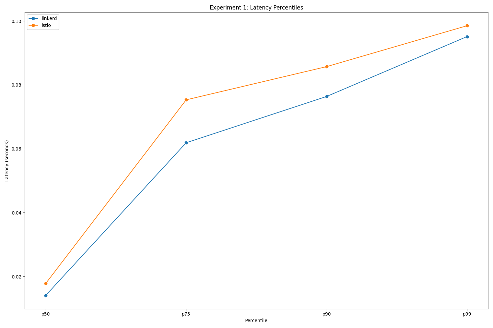
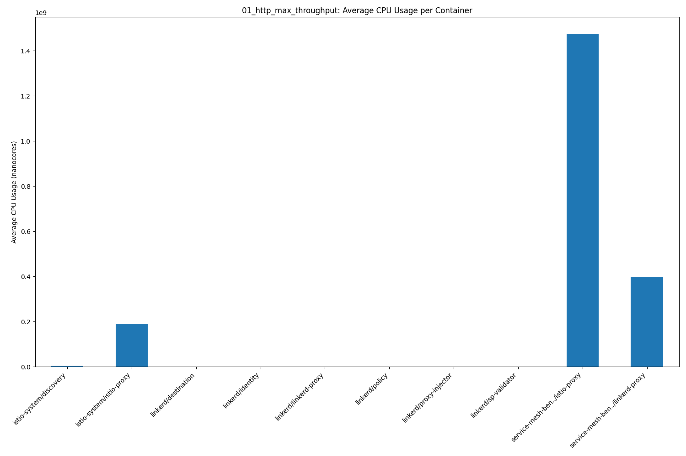


### Constant HTTP Throughput (1000 QPS)

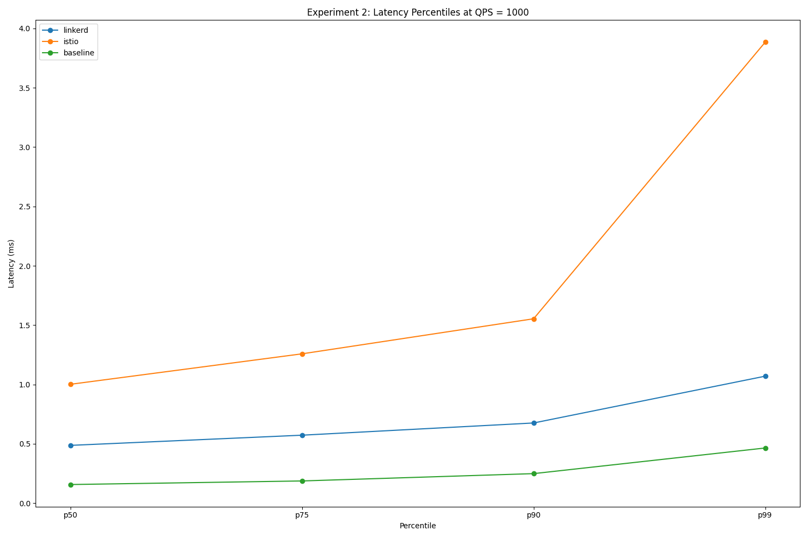
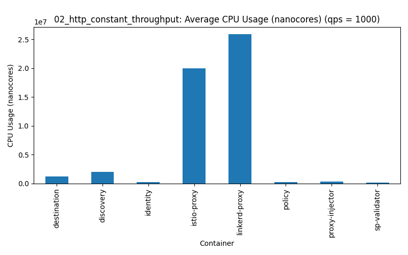


### Constant HTTP Throughput (10000 QPS)

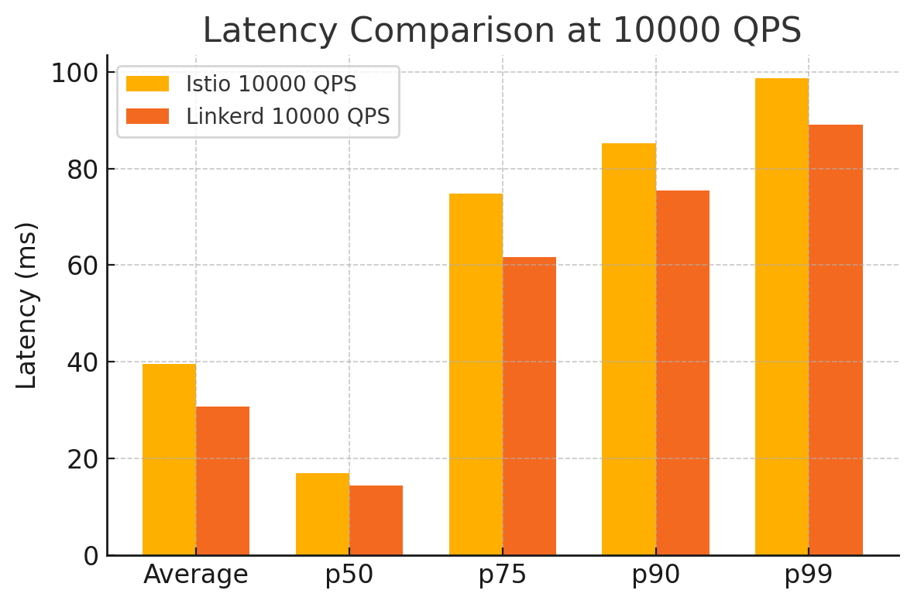
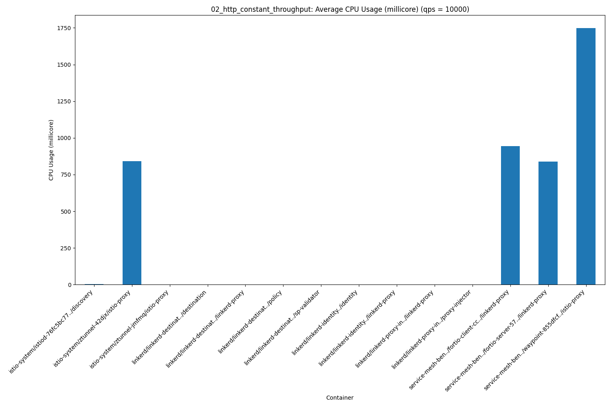
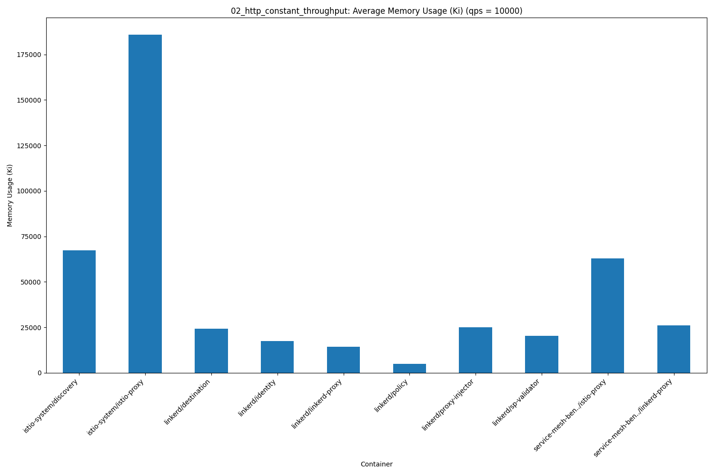

### Constant HTTP Throughput (100 QPS) with 1 KB Payload

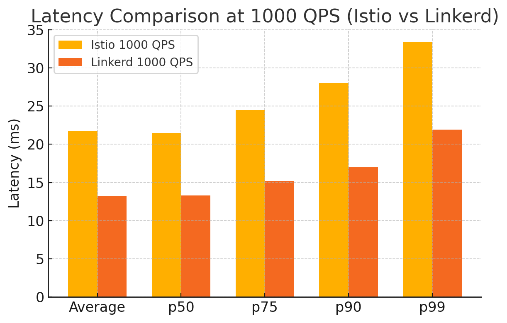
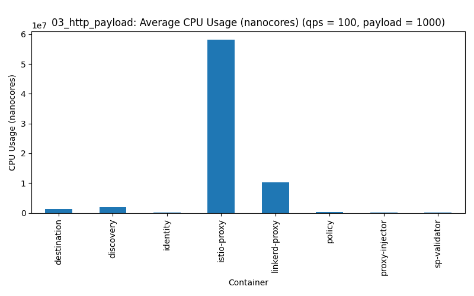
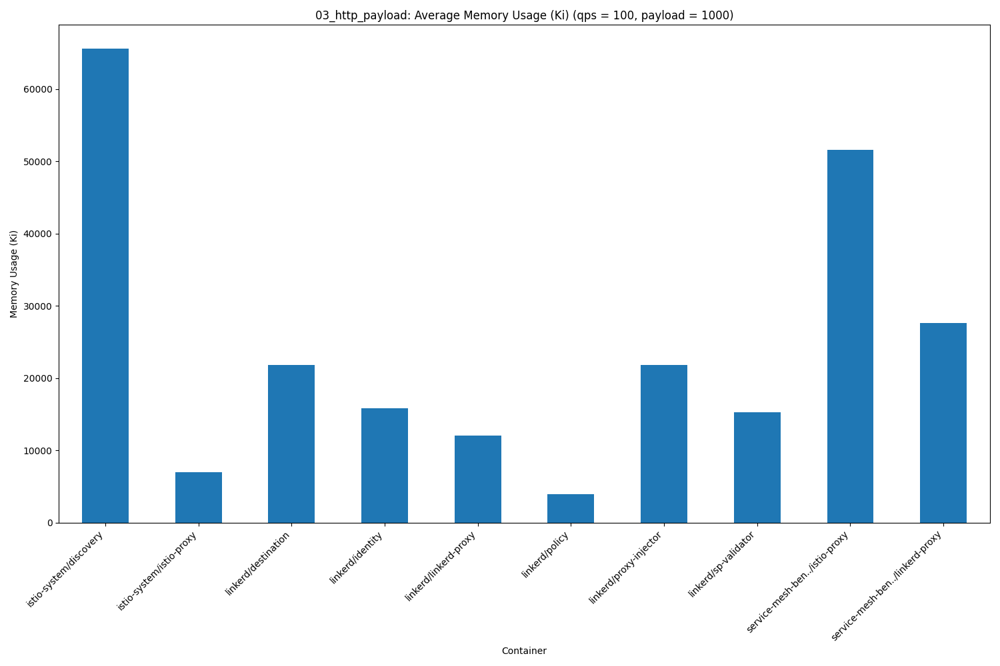

### Constant HTTP Throughput (100 QPS) with 10 KB Payload

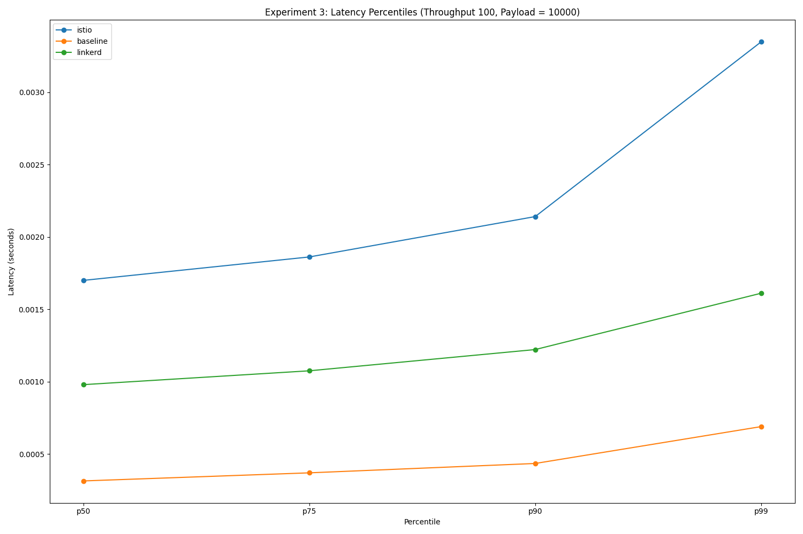
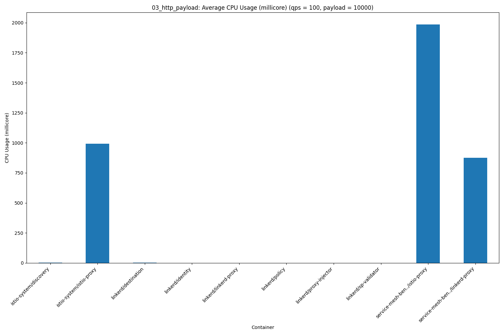
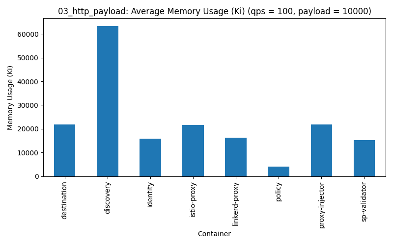

# Contributing

Contributions are welcome! Please fork the repository and submit a pull request with your improvements. For major changes, please open an issue first to discuss what you would like to change.

# License

This project is licensed under the MIT License.