# Seshat

This repository provides a collection of Bash scripts to automate the setup of an Azure Kubernetes Service (AKS) environment along with service meshes (Istio and Linkerd) and Fortio load testing. The scripts simplify tasks such as creating resource groups, deploying an AKS cluster, installing service meshes, and running load tests with automated metrics collection.

To collect the metrics, the scripts use the Kubernetes API directly, avoiding the need for additional monitoring tools and reducing system overhead while ensuring real-time data retrieval.

# Features

- **Azure Environment Setup:** Automates the creation of resource groups and AKS clusters using the Azure CLI.
- **Service Mesh Installation:** Supports installation of both Istio and Linkerd, including CLI setup and control plane deployment.
- **Fortio Deployment & Load Testing:** Installs Fortio and provides functions to execute HTTP load tests with varying parameters such as queries per second and payload sizes.
- **Resource Metrics Export:** Collects container-level CPU and memory metrics periodically during load tests.
- **Color-Coded Logging:** A reusable logging utility for consistent, color-coded log messages to enhance readability and debugging.

# Prerequisites
Before running the scripts, ensure that you have:
- Azure CLI installed and logged in.
- kubectl configured for your AKS cluster.
- `jq` for JSON parsing (used in metrics collection).
- Appropriate permissions to create and manage resources in your Azure subscription.
- The required namespaces and deployments (e.g., Fortio client/server, service mesh components) already deployed or available via the scripts.

# Experiments
The versions compared are:
- Linkerd Edge 25.4.1
- Istio 1.25.1 (Ambient)
The environment is:
- Microsoft AKS running Kubernetes 1.30.10
- 2 Standard_D4s_v3 nodes (Memory: xxx, CPU: xxx) running Ubuntu
- Fortio 1.69.1
Fortio configuration:
- 100 connections
- 1-minute duration
- 1-second interval metrics

## Results (8/04/2025)
The following are the results of the HTTP Max Throughput test:

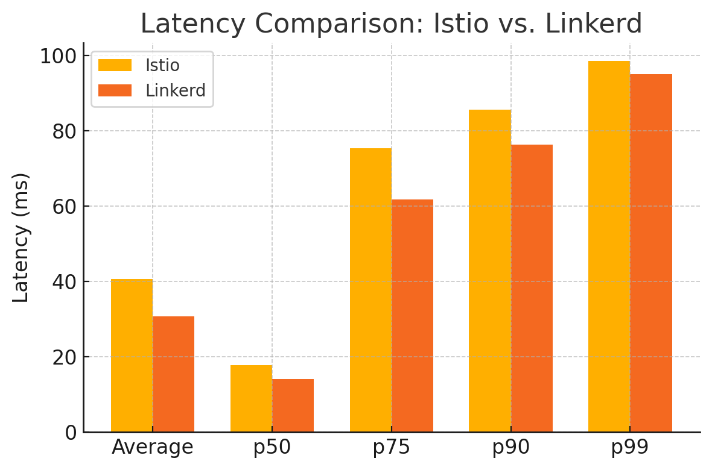
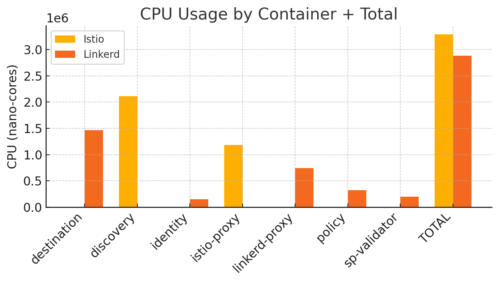
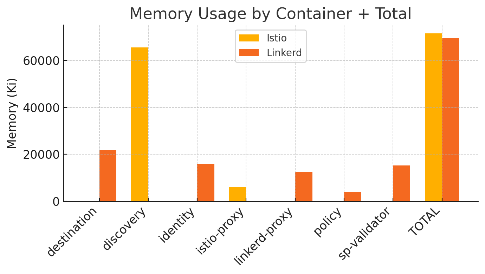

The following are the results for constant HTTP throughput (1000 QPS):

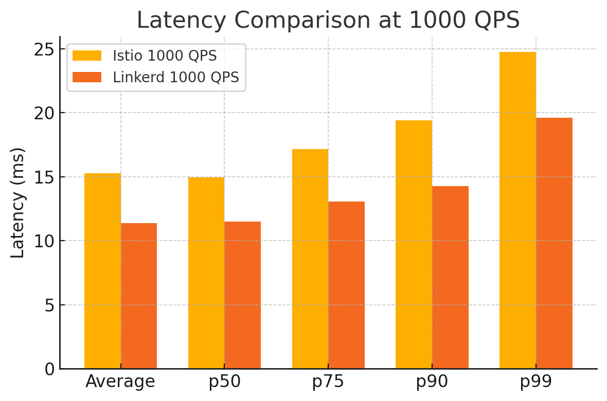
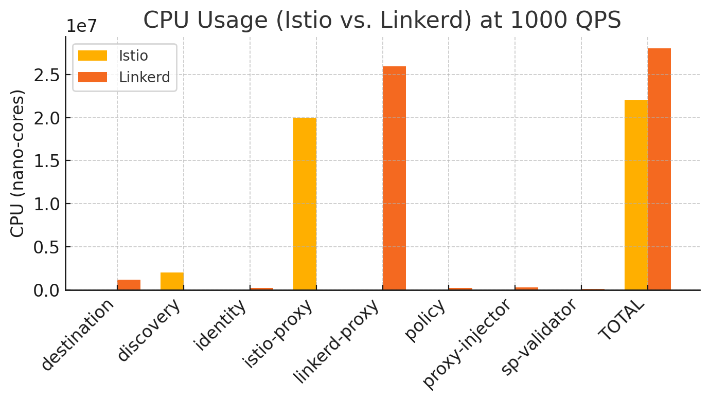
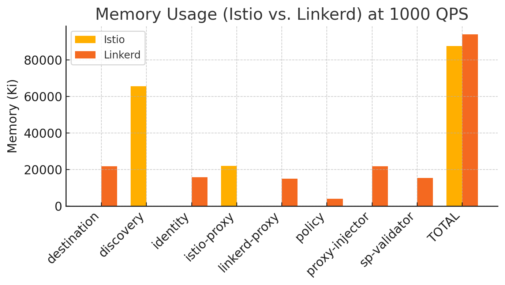

The following are the results for constant HTTP throughput (10000 QPS):

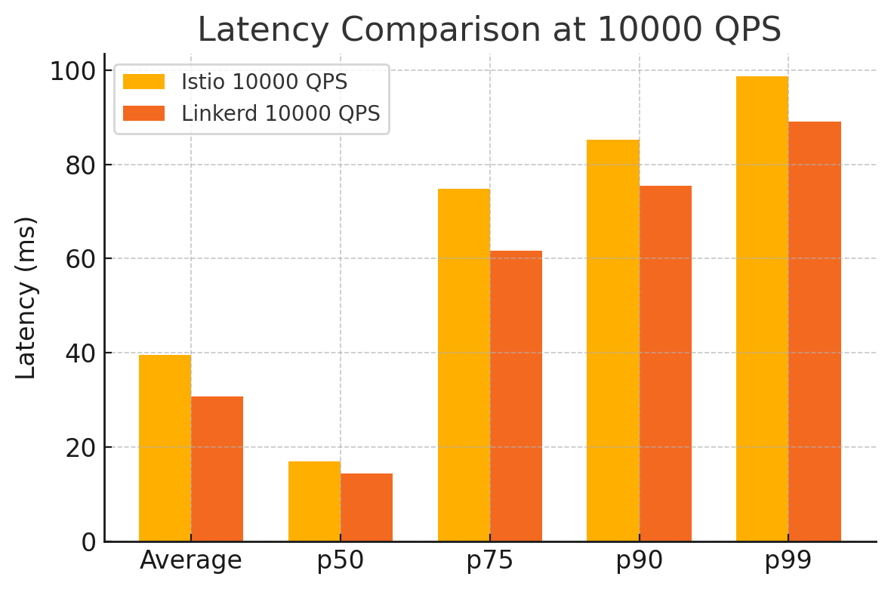
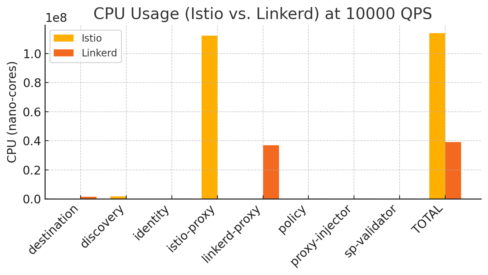

The following are the results for constant HTTP throughput (100 QPS) with variable payload size (1 KB):

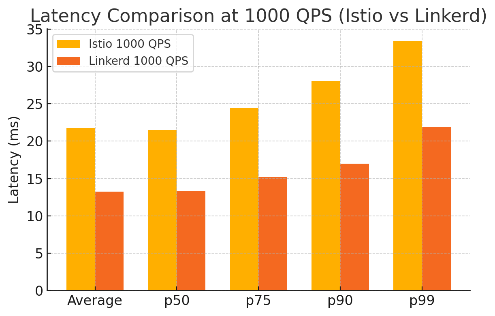
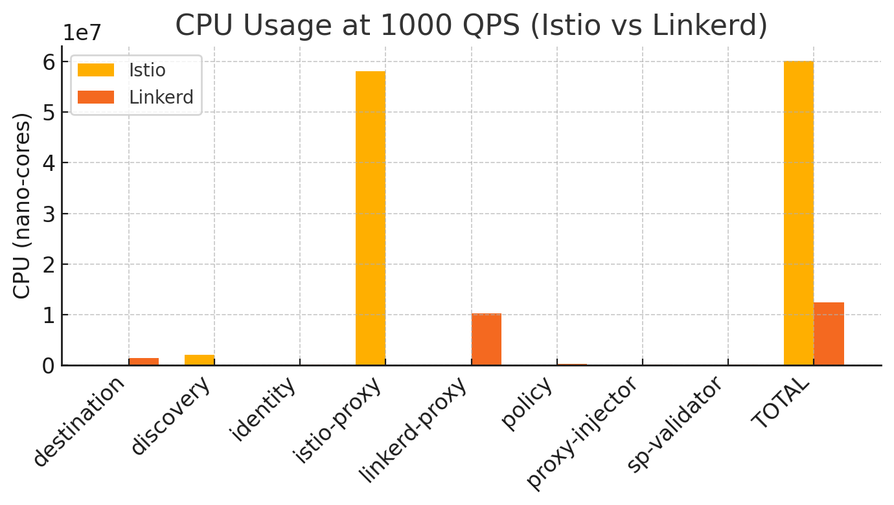

The following are the results for constant HTTP throughput (100 QPS) with variable payload size (10 KB):

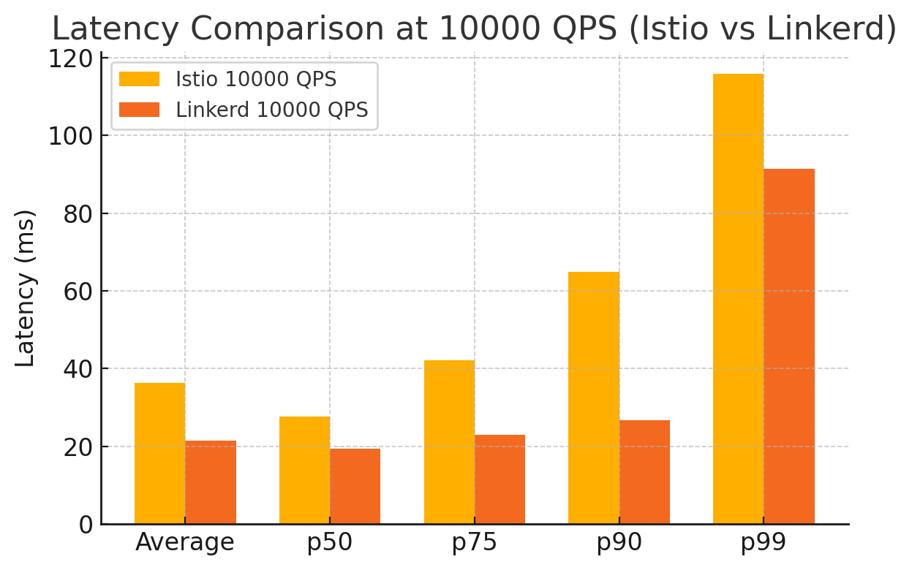
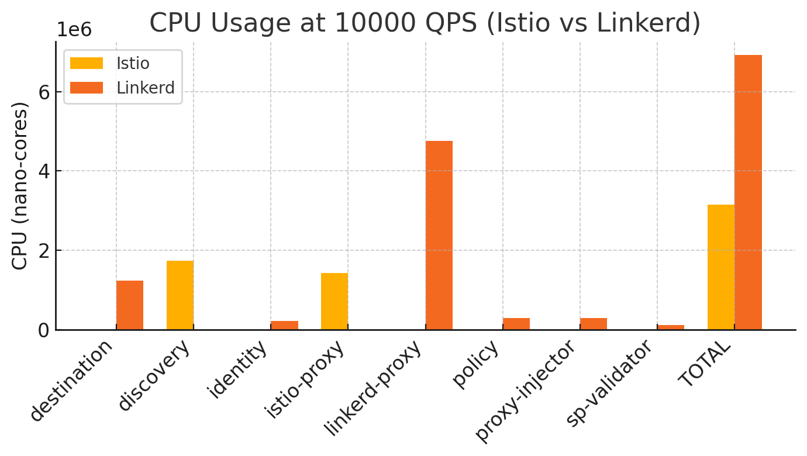
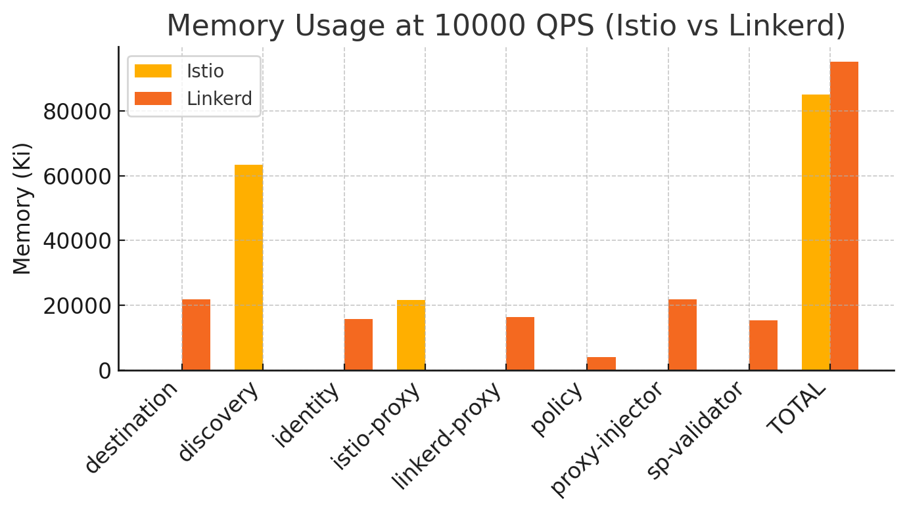

# Contributing

Contributions are welcome! Please fork the repository and submit a pull request with your improvements. For major changes, please open an issue first to discuss what you would like to change.

# License

This project is licensed under the MIT License.