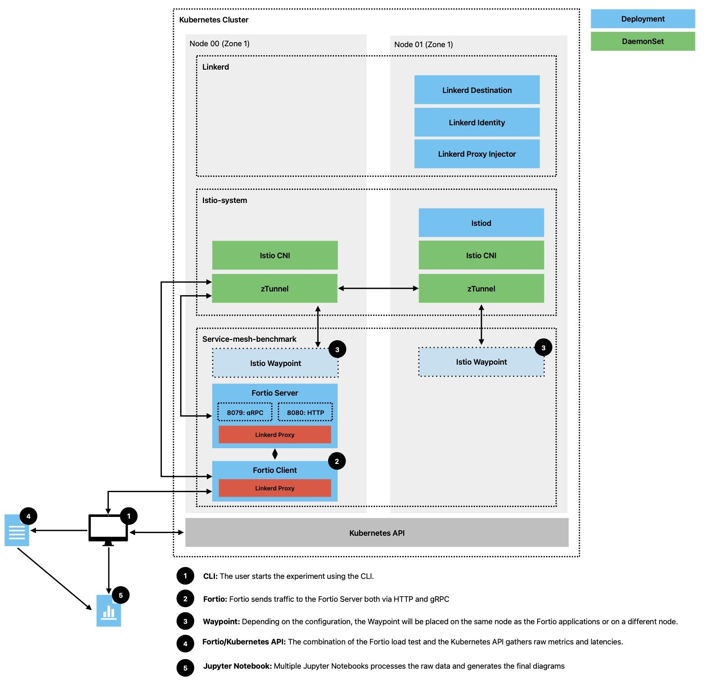

# Seshat

This repository provides a collection of Bash scripts to automate the setup of an Azure Kubernetes Service (AKS) environment along with service meshes (Istio and Linkerd) and Fortio load testing. The scripts simplify tasks such as creating resource groups, deploying an AKS cluster, installing service meshes, and running load tests with automated metrics collection.

To collect the metrics, the scripts use the Kubernetes API directly, avoiding the need for additional monitoring tools and reducing system overhead while ensuring real-time data retrieval.

# Features

- **Azure Environment Setup:** Automates the creation of resource groups and AKS clusters using the Azure CLI.
- **Service Mesh Installation:** Supports installation of both Istio and Linkerd, including CLI setup and control plane deployment.
- **Fortio Deployment & Load Testing:** Installs Fortio and provides functions to execute HTTP/gRPC load tests with varying parameters such as queries per second and payload sizes.
- **Resource Metrics Export:** Collects container-level CPU and memory metrics periodically during load tests.
- **Color-Coded Logging:** A reusable logging utility for consistent, color-coded log messages to enhance readability and debugging.

# Architecture

The diagram below illustrates the distribution of various resources within the cluster and provides an overview of the test workflow.



# Prerequisites

Before running the scripts, ensure that you have:
- Azure CLI installed and logged in.
- `kubectl` configured for your AKS cluster.
- `jq` for JSON parsing (used in metrics collection).
- Appropriate permissions to create and manage resources in your Azure subscription.

# How to use it

- **Login to Azure:** First, you need to provision the resources on Azure. Begin by logging in via the Azure CLI in your local terminal `az login`
- **Set the Subscription Name:** Replace the `AZURE_SUBSCRIPTION_NAME` value with the name of the subscription where you want to deploy your resources.
- **Run the Setup Script:** Execute the `setup.sh` script. This will provision all necessary resources.

To keep the setup as clear as possible:
- A node will be tainted so that only Fortio is deployed there. You can optionally deploy the Istio Waypoint in the same node using the `ISTIO_WAYPOINT_PLACEMENT="same"`
- Istio and Linkerd will be downloaded and installed on another node, based on the `ISTIO_VERSION` and `LINKERD_VERSION` environment variables.

Before each load test, it will start a background job that collects metrics via the Kubernetes API. These metrics are saved to a file corresponding to the specific test. Once the test is completed, the script will automatically stop the metrics collection process. To begin an experiment, set the `MESH` variable to your desired service mesh and run the script:

```
export MESH=istio  # baseline, istio or linkerd
./experiments.sh
```

# Diagrams

To generate diagrams from the Jupyter Notebook (.ipynb) files in the `diagrams/` directory, it is recommended to create a Python virtual environment.
- Open the Command Palette in VS Code (⇧⌘P)
- Search for **Python: Create Environment** and follow the prompts

For more detailed setup instructions, see the [official VS Code docs](https://code.visualstudio.com/docs/python/environments).
Once your environment is set up, activate it and install the required Python dependencies:

```
source .venv/bin/activate
pip install pandas
pip install matplotlib
```

Once the environment is set up and dependencies are installed, run the Jupyter Notebooks in the diagrams/ directory. Each notebook processes experimental data to generate up-to-date visual representations of:
- CPU usage
- Memory consumption

The outputs include separate diagrams for individual container metrics (covering both data plane components and all containers) as well as consolidated metrics for the control plane.
This setup ensures you have a reproducible environment for generating, updating, and analyzing the performance diagrams from your experiments.

# Experiments

The versions compared are:
- Linkerd Edge 25.4.1
- Istio 1.25.1 (Ambient)

The environment is:
- Microsoft AKS running Kubernetes 1.30.10
- 2 Standard_D4_v5 nodes (32 GiB Memory, 8 vCPUs) running Ubuntu Linux
- Fortio 1.69.1
- Istio Waypoiny deployed in the same node as the Fortio Client/Server pods.

Fortio configuration:
- 50 connections (maximum number of threads)
- 3-minute duration
- 1-second interval metrics

## Latests Results 
The following images are automatically generated and updated by the Jupyter Notebook during each iteration. 

### Experiment 1 (HTTP Max Throughput Test)


#### Latency


#### Resources Consumption


### Experiment 2 (gRPC Max Throughput Test)


#### Latency


#### Resources Consumption


### Experiment 3 (HTTP Constant Throughput Test)

#### Latency


#### Resources Consumption


### Experiment 4 (gRPC Constant Throughput Test)

#### Latency


#### Resources Consumption


### Experiment 5 (HTTP Constant Throughput with Payload Test)

#### Latency


<!--  -->

#### Resources Consumption


<!--  -->


<!--  -->


<!--  -->


<!--  -->


### Experiment 6 (HTTP Constant Throughput with HTTPRoute header-based routing Test)

#### Latency


#### Resources Consumption


### Experiment 7 (HTTP Constant Throughput with 30 Fortio client replicas Test)


# Contributing

Contributions are welcome! Please fork the repository and submit a pull request with your improvements. For major changes, please open an issue first to discuss what you would like to change.

# License

This project is licensed under the MIT License.